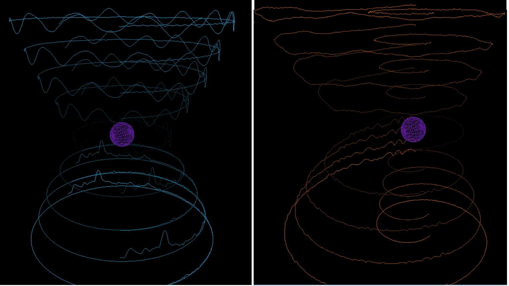

# SandsOfSound
A real time audio spectrum visualizer in the shape of an hourglass built with C++, OpenGL, RtAudio, ChucK

For more details check the [webpage](web/index.html)

## Author: Abhijeet Phatak

### <u>Introduction:</u>

The goal of this assignment was to make a real-time audio (spectrum) visualizer to visualize audio signals in time and frequency domain. I named this project sands of sound because it is made to look like an hourglass. Hourglass was one of the first instruments used to keep track of time. The top half of the hourglass shows a waterfall plot of the time domain signal and the lower half of the hourglass shows the frequency domain waterfall.

For nerds like me, this is what I am trying to say \\[ X(\omega) = \int_{-\infty}^{\infty} x(t) e ^{-j \omega t} \mathrm{d}t = \int_{-\infty}^{\infty} x(t) e ^{-j 2 \pi f t} \mathrm{d}t \\]  \\[ x(t) = \frac{1}{2 \pi} \int_{-\infty}^{\infty} X(\omega) e ^{j \omega t} \mathrm{d}\omega = \int_{-\infty}^{\infty} X(f) e ^{j 2 \pi f t} \mathrm{d}f \\] \\[ x(t) \Leftrightarrow X(w) \\]

One of the motivations to make this was to say that time and frequncy is related by the Fourier transform. That is why I made a symmetrical structure showing that its just a different way to perceive signals. I do understand that time and frequency and orthogonal but an orthogonal hourglass is something that you don't want to see.

To this end, I would like to dedicate this project to Joseph Fourier, the French mathematician who came up with the brilliant idea of Fourier analysis. The idea of decomposing a signal into its individual frequency components and calculating how much does each frequency contribute (amplitude) to the signal has revolutionized our understanding of the world. It will be wrong of me to not dedicate this to James Cooley and John Tukey, the inventors of the Fast Fourier Transform (FFT) algorithm without which real-time spectrum analysis would not be possible. Fourier analysis and the FFT are extensively used in various domains of science and technology without most of us even realizing or appreciating it.

### <u>Aspects of Visual Design</u>

<u>Minimalism -</u> I tried to keep the design minimialistic by not adding too many elements. However, I spent some time optimizing the geometry of the visuals to look like an hourglass.  
<u>Interactivity-</u> Added some modes so that users can interact with the visualizer.  
<u>Focus-</u> Although time and frequency are orthogonal, the idea was to convey that they are still related and just a different lens.  
<u>Void-</u> At the center of the field of view, one can see a sphere that floats around. The idea is that as time progresses, signals decay and disappear into the void.  

### <u>Screenshots:</u>

Here are some of the screenshots. 

### <u>Narrative:</u>

The narrative is composed of 3 parts. It can be played through the visualizer by pressing 'n' key.  
The first part is meditative chanting of Om or Aum (ॐ) which is a Hindu sacred sound.  
Second part is a time varying frequency signal. I was inspired by the illustration in the textbook where a time varying frequency (chirped) signal appears as peaks in the frequency domain shifted by a small amount.  
Third part is a Markov Chain based composition of Twinkle twinkle little star. Enter Zen!  

### <u>Modes:</u>

As the goal was to have a minimialistic design, I refrained from adding too many modes. Here are the supported modes.  
'c' - Randomize the colors used for plotting  
's' - Show as a spiral as opposed to a circle  
'n' - Play narrative  
'o' - Go back to circular plot  

### <u>Thanks:</u>

I would like to thank Ge Wang for this amazing course and giving me a new perspective on technology. Thanks to Jack for being an awesome TA. I would also like to thank my classmates for their feedback and showing their cool ideas.

